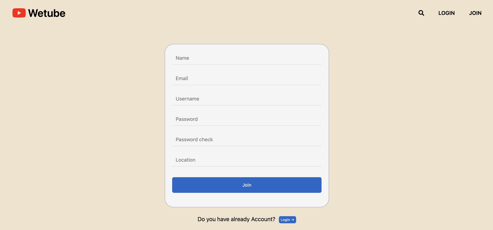
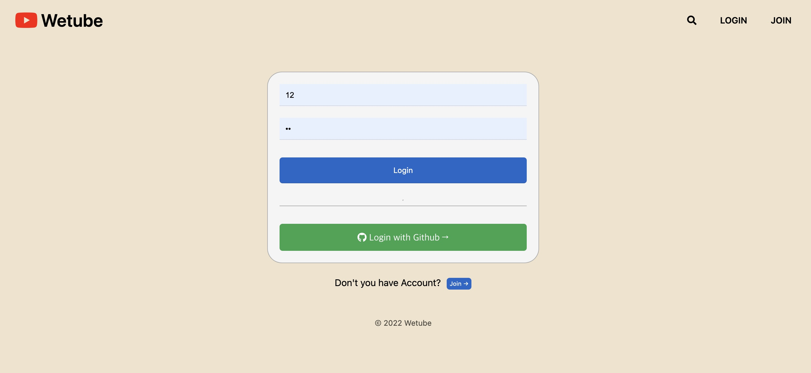
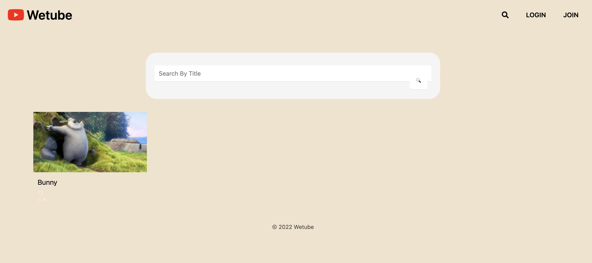
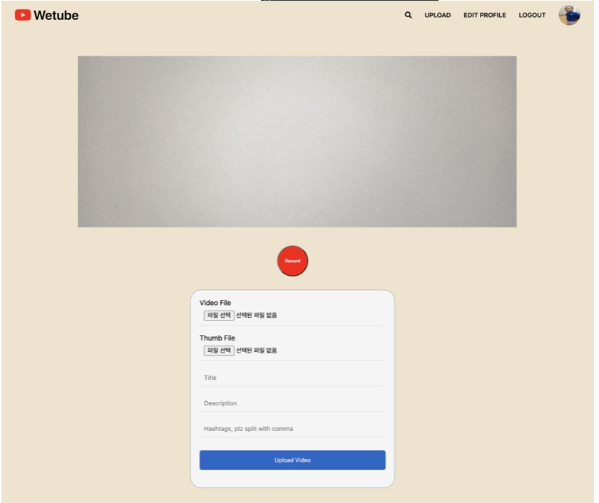

# 1. wetube Clone-2021

## Contents

- [Contents](#contents)
  - [Preview](#preview)      
  - [Pug 사용](#pug-사용)
  - [MongoDB 및 Mongoose 사용](#mongodb-및-mongoose-사용)
  - [Join Login LogOut Password Change 구현](#join-login-logout-password-change-구현)
  - [Middle Ware 사용](#middle-ware-사용)
  - [Webpack babel 사용](#webpack-babel-사용)
  - [JavaScript의 video기능 활용](#javascript의-video기능-활용)
  - [fetch를 사용하여 서버와 연결](#fetch를-사용하여-서버와-연결)
  - [AWS를 사용하여 파일 업로드](#aws를-사용하여-파일-업로드)  
  - [Heroku와 MongoDB Atlas를 통해 실제 서버 배포](#heroku와-mongodb-atlas를-통해-실제-서버-배포)

## Preview

| Feature     | Image                                        |
| ----------- | -------------------------------------------- |
| Home Page   |     |
| Join Page   |     |
| LogIn Page  |    |
| Search Page |   |
| Upload Page |   |

## Pug 사용
       
        - pug란 템플릿 엔진으로서 자바스크립트를 사용하여, HTML을 랜더링 할 수 있다.
        - extends로 상속하여 코드 반복 방지
        - partials을 통해 코드 반복 방지
        - mixin을 사용하여 코드 반복 방지

## MongoDB 및 Mongoose 사용

        - mongoDB를 mongoose를 통해 연결
        - Schema로 model을 인스턴스화 시켜 DB의 데이터를 구현
        - queries를 사용하여 CRUD방식 사용 
 
## Join Login LogOut Password Change 구현

        - bcrypt를 사용하여 비밀번호 hashing
        - session을 사용하여, 로그인 구현 
        - fetch를 사용하여 github로 로그인 구현
        - session을 Destroy하여 로그아웃 구현
        - bcrypt compare함수를 이용해 비밀번호 체크후 변경 구현 

  
## Middle Ware 사용

        - Middle Ware란 운영 체제와 해당 운영 체제에서 실행되는 응용 프로그램 사이에 존재하는 소프트웨어이며 복잡한 분산 시스템에서 이기종간에 통신 및 데이터 관리 등 가능하게 통합 관리해주는 역할을 한다.
        - locals를 이용하여, 전역변수 설정 및 사용
        - protect,private middleware를 통해 사이트 보안 유지 
        - multer MiddleWare를 이용한 사진 및 비디오 업로드 

## Webpack Babel 사용

        - webpack이란 모듈 번들링이라고 하며, html 파일에 들어가는 자바스크립트 파일들을 하나의 자바스크립트 파일로 만들어주는 방식을 모듈 번들링이라고 한다. 쉽게 말하면, 필요한 다수의 자바스크립트 파일을 하나의 자바 스크립트 파일로 만들어 주는 것을 Webpack 이라고 한다.
        - babel이란 JS의 컴파일러 로서,  node가 이해못하는 최신 JS코드(ES6)를 변환 해주는것이다 => 즉 babel을 설치 및 세팅 해놓으면 최신식으로 코드를 작성할수있다.
        - webpack을 사용하여, JS, SCSS, CSS, HTML 등을 변환
        - babel을 사용하여, 최신코드 사용 및 코드 압축(Build)
  

## JavaScript의 video기능 활용 

        - video의 play, pause 버튼을 구현
        - video의 mute, unmute 기능 구현
        - video의 currentTime과 totalTime 구현
        - video의 fullScreen 기능 구현 

## fetch를 사용하여 서버와 연결

        - fetch를 사용하여, 실시간 댓글 추가, 삭제 기능 구현.
        - fetch를 사용하여, view를 추가. 

## AWS를 사용하여 파일 업로드

        - AWS S3를 사용하여, video, image를 저장. 
        - AWS IAM을 사용하여, 안전하게 제어 
     

## Heroku와 MongoDB Atlas를 통해 실제 서버 배포

        - Heroku를 사용하여, 실제 서버를 배포.
        - MongoDB Atlas에 실제 DB를 저장. 
     
