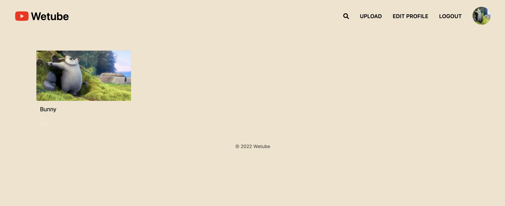

# 1. wetube Clone-2021

| Feature     | Image                                        |
| ----------- | -------------------------------------------- |
| Home Page   |     |
| Join Page   |     |
| LogIn Page  |    |
| Search Page |   |
| Upload Page |   |

- ## <사용기술>

- - [x]  pug 사용
       
        - extends로 상속하여 코드 반복 방지
        - partials을 통해 코드 반복 방지
        - mixin을 사용하여 코드 반복 방지
  ---
- - [x]  MongoDB 및 Mongoose를 사용하여 서버연결

        - mongoDB를 mongoose를 통해 연결
        - Schema로 model을 인스턴스화 시켜 DB의 데이터를 구현
        - queries를 사용하여 CRUD방식 사용 
 
  ---
- - [x]  회원가입, 로그인,로그아웃,비밀번호 변경 구현

        - bcrypt를 사용하여 비밀번호 hashing
        - session을 사용하여, 로그인 구현 
        - fetch를 사용하여 github로 로그인 구현
        - session을 Destroy하여 로그아웃 구현
        - bcrypt compare함수를 이용해 비밀번호 체크후 변경 구현 
  ---
  
- - [x]  Middle Ware 사용 (전역변수, 파일 업로드) 

        - locals를 이용하여, 전역변수 설정 및 사용
        - protect,private middleware를 통해 사이트 보안 유지 
        - multer MiddleWare를 이용한 사진 및 비디오 업로드 
  ---

- - [x]  webpack, babel을 사용하여, 최신코드를 사용 및 변환

        - webpack을 사용하여, JS, SCSS, CSS, HTML 등을 변환
        - babel을 사용하여, 최신코드 사용 및 코드 압축(Build)
  ---

- - [x]  JavaScript를 사용하여, 여러가지 기능 구현

        - video의 play, pause 버튼을 구현
        - video의 mute, unmute 기능 구현
        - video의 currentTime과 totalTime 구현
        - video의 fullScreen 기능 구현 
  ---

- - [x]  fetch를 사용하여 서버와 연결

        - fetch를 사용하여, 실시간 댓글 추가, 삭제 기능 구현.
        - fetch를 사용하여, view를 추가. 
  ---

- - [x]   AWS를 사용하여 파일 업로드

        - AWS S3를 사용하여, video, image를 저장. 
        - AWS IAM을 사용하여, 안전하게 제어 
     
  ---
- - [x]   Heroku와 MongoDB Atlas를 통해 실제 서버 배포

        - Heroku를 사용하여, 실제 서버를 배포.
        - MongoDB Atlas에 실제 DB를 저장. 
     
  ---
